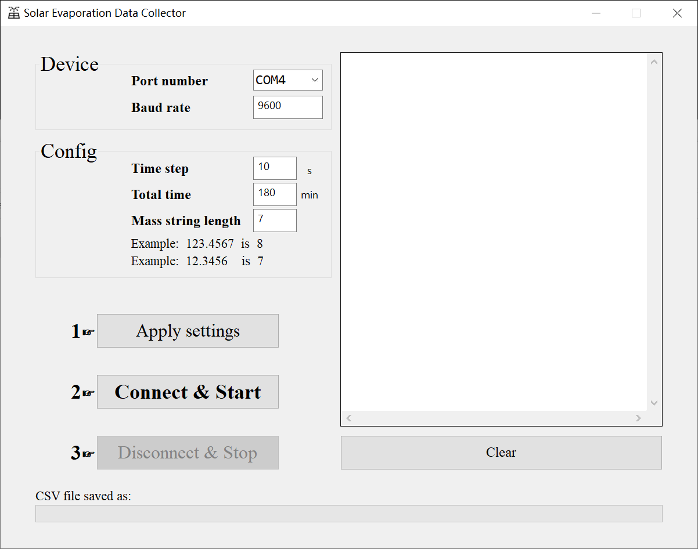

# SolarEvaporationDataCollector

Have a try with aardio. Write a program to record the balance data for solar evaporation experiments.

## Usage
Download `` SolarEvaporationDataCollector.exe `` from [release page](https://github.com/HKFoggyU/SolarEvaporationDataCollector/releases/latest). The exe file is self-explanatory.

